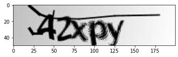
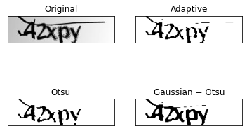
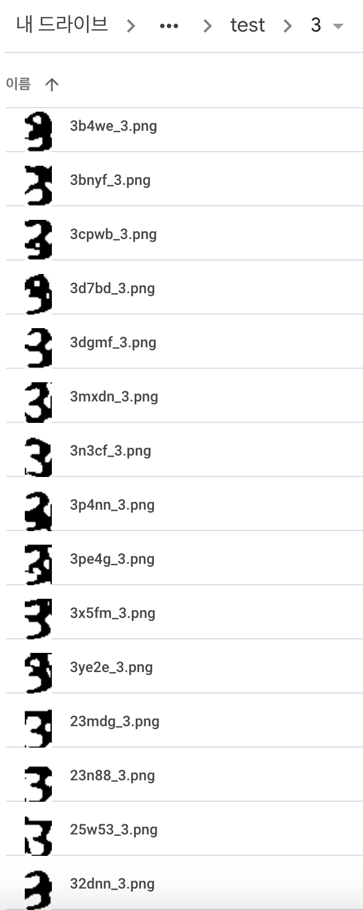
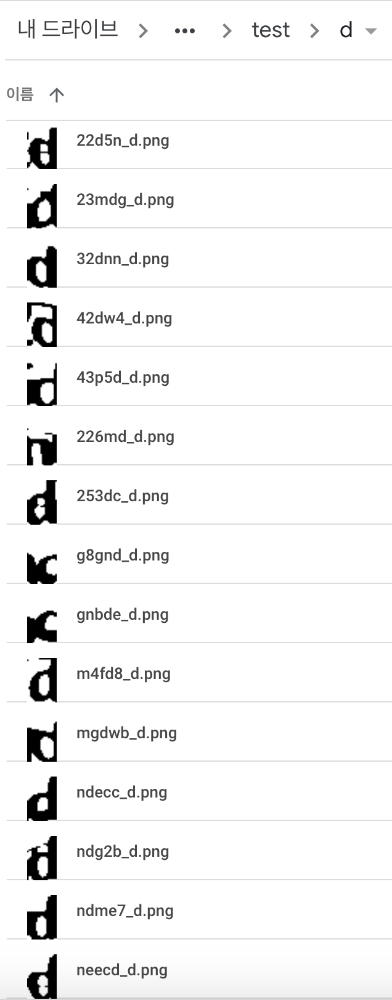
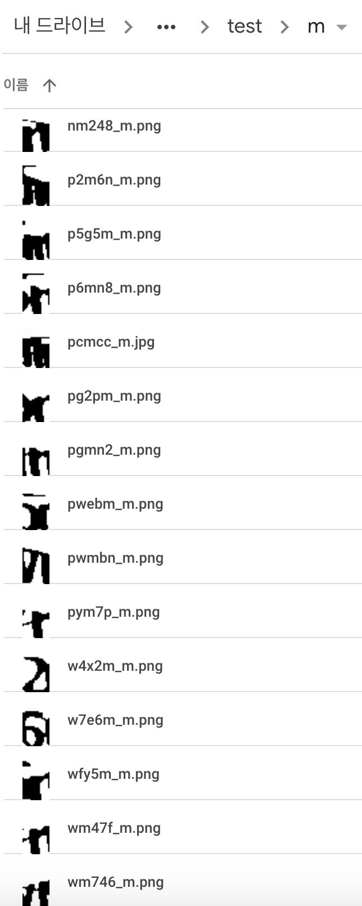
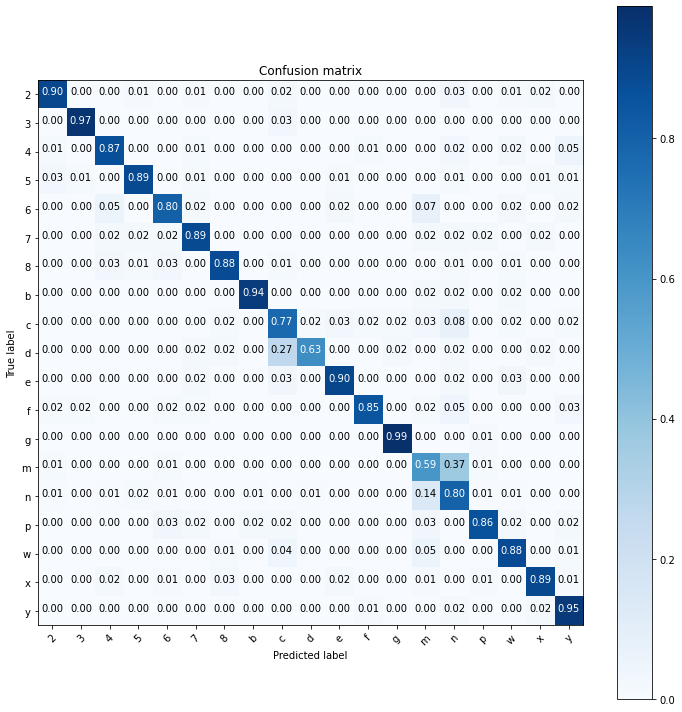

# CAPTCHA-recognition
Term project of CT5302 Deep Learning (GIST)


## 0. Dataset
[Version 2 CAPTCHA Images (from Kaggle)](https://www.kaggle.com/fournierp/captcha-version-2-images)
  * 1070 images files of 5 letter words (200 x 50, .png or .jpg) 
    * Train: 749 images * 5 chars (70% of dataset)
      * Reduced to 3207 char images after preprocessing
    * Test: 321 images * 5 chars (30% of dataset)


## 1. Preprocessing CAPTCHA Images with OpenCV
* Notebook: [image_preprocess.ipynb](image_preprocess.ipynb)

* Preprocessed Dataset (result)
  * `charset = ['2', '3', '4', '5', '6', '7', '8', 'b', 'c', 'd', 'e', 'f', 'g', 'm', 'n', 'p', 'w', 'x', 'y']` (19 classes)
  * Download the preprocessed dataset [Here](https://drive.google.com/drive/folders/1uz6nel0_x5l8mPI8p1HVw5oSAovEmNy7?usp=sharing)

* Process of Image Preprocessing
  1. Otsu threholding with Gaussian Blur
  
     <center></center>
     
  2. Dilation -> Erosion -> Dilation
  
      <center></center>
    
  3. Split into characters by fixed coordinates
  
      <center></center>
    
  4. Reclassify some misclassified characters in Train Dataset by hand
      * 'm' and 'w' can occupy the width for two characters so some characters were missed or misclassified.
  5. Remove some ambiguously split characters in Train Dataset by hand
      * The characters are not always accurately located at the coordinates, so some characters were split partially. 
      * 'm' and 'w' can occupy the width for two characters, so 'm' can be cut into two 'n's and 'w' can be cut into two 'v's. 

* Test Samples
  
  <center></center>
  <center></center>
  <center></center>

* Reference
  * [OpenCV Word Segmenting on CAPTCHA Images](https://www.kaggle.com/fournierp/opencv-word-segmenting-on-captcha-images)


## 2. Train and Test the Preprocessed CAPTCHA Images with ResNet-18
* Notebook: [train_and_test_captcha_resnet18.ipynb](train_and_test_captcha_resnet18.ipynb)

* Model
  * ResNet-18
    * Set input channel of model.conv1 as 1 (grayscale) and out_features of model.fc as 19
    * Load pretrained parameters [(Download)](https://drive.google.com/file/d/1hQ1mXBphoKtvsJSmU1vlvYrmoiDb72tM/view?usp=sharing)
    * Training accuracy: 100%
    * Test accuracy: 85.88%
      * See the confusion matrix below.
  
* Input
  * The preprocessed dataset [(Download)](https://drive.google.com/drive/folders/1uz6nel0_x5l8mPI8p1HVw5oSAovEmNy7?usp=sharing)
  
* Output
  * One of `charset`
    * ['2', '3', '4', '5', '6', '7', '8', 'b', 'c', 'd', 'e', 'f', 'g', 'm', 'n', 'p', 'w', 'x', 'y'] (19 classes)
  * Concatenate output from each 5 characters of CAPTCHA to generate the predicted label

      ```
      answer: gfp54, predicted: gfp54, percentage of chars correct: 100.0%
      answer: nbfx5, predicted: mbfx5, percentage of chars correct: 80.0%
      answer: mg5nn, predicted: mg5nn, percentage of chars correct: 100.0%
      answer: n5wbg, predicted: n5wbg, percentage of chars correct: 100.0%
      answer: gcx6f, predicted: gcx6f, percentage of chars correct: 100.0%
      answer: neecd, predicted: neecd, percentage of chars correct: 100.0%
      answer: g842c, predicted: g842c, percentage of chars correct: 100.0%
      answer: m4fd8, predicted: m4fd8, percentage of chars correct: 100.0%
      answer: pn7pn, predicted: pn7pn, percentage of chars correct: 100.0%
      answer: gnf85, predicted: gnf85, percentage of chars correct: 100.0%
      answer: ndg2b, predicted: mdg2b, percentage of chars correct: 80.0%
      answer: nfg23, predicted: nfg23, percentage of chars correct: 100.0%
      answer: m2nf4, predicted: m22nf, percentage of chars correct: 40.0%
      answer: g6n7x, predicted: g6n7x, percentage of chars correct: 100.0%
      answer: gymmn, predicted: gymmm, percentage of chars correct: 80.0%
      answer: m448b, predicted: m448b, percentage of chars correct: 100.0%
      answer: mm3nn, predicted: mm3nn, percentage of chars correct: 100.0%
      answer: mfb3x, predicted: mmb3x, percentage of chars correct: 80.0%
      answer: ndecc, predicted: ndecc, percentage of chars correct: 100.0%
      answer: n2c85, predicted: n2c85, percentage of chars correct: 100.0%
      answer: gcfgp, predicted: gcfgp, percentage of chars correct: 100.0%
      answer: gewfy, predicted: gewyf, percentage of chars correct: 60.0%
      answer: mcyfx, predicted: mcyfx, percentage of chars correct: 100.0%
      answer: pwmbn, predicted: pwnmb, percentage of chars correct: 40.0%
      answer: m8m4x, predicted: n8nn4, percentage of chars correct: 20.0%
      answer: geyn5, predicted: geyn5, percentage of chars correct: 100.0%
      answer: pp546, predicted: pp546, percentage of chars correct: 100.0%
      answer: gxxpf, predicted: gxxpf, percentage of chars correct: 100.0%
      answer: gnbde, predicted: gnbce, percentage of chars correct: 80.0%
      answer: m2576, predicted: mn557, percentage of chars correct: 40.0%
      answer: pgmn2, predicted: pgnnn, percentage of chars correct: 60.0%
      answer: pybee, predicted: pybee, percentage of chars correct: 100.0%
      answer: gpnxn, predicted: gpnxn, percentage of chars correct: 100.0%
      answer: n7ebx, predicted: n7ebx, percentage of chars correct: 100.0%
      answer: p8ngx, predicted: p8ngx, percentage of chars correct: 100.0%
      answer: pg4bf, predicted: pg4bf, percentage of chars correct: 100.0%
      answer: p57fn, predicted: p57fn, percentage of chars correct: 100.0%
      answer: gn2xy, predicted: pn2xy, percentage of chars correct: 80.0%
      answer: p5g5m, predicted: p5g5m, percentage of chars correct: 100.0%
      answer: mfc35, predicted: mnfc3, percentage of chars correct: 20.0%
      answer: n2gmg, predicted: n2gmg, percentage of chars correct: 100.0%
      answer: p6mn8, predicted: p6nmn, percentage of chars correct: 40.0%
      answer: gpxng, predicted: gpxng, percentage of chars correct: 100.0%
      answer: nxc83, predicted: nxc83, percentage of chars correct: 100.0%
      answer: nbcgb, predicted: nbcgb, percentage of chars correct: 100.0%
      answer: gm7n8, predicted: gm7n8, percentage of chars correct: 100.0%
      answer: pe4xn, predicted: pe4xn, percentage of chars correct: 100.0%
      answer: mmy5n, predicted: mmy5n, percentage of chars correct: 100.0%
      answer: m3588, predicted: n3588, percentage of chars correct: 80.0%
      answer: gnbn4, predicted: gnbn4, percentage of chars correct: 100.0%
      answer: pg2pm, predicted: pg2pn, percentage of chars correct: 80.0%
      answer: ne325, predicted: ne325, percentage of chars correct: 100.0%
      answer: ny3nn, predicted: ny3nn, percentage of chars correct: 100.0%
      answer: mpmy5, predicted: mpmy5, percentage of chars correct: 100.0%
      answer: mxnw4, predicted: mxnmw, percentage of chars correct: 60.0%
      answer: pxdwp, predicted: wxdww, percentage of chars correct: 60.0%
      answer: mc8w2, predicted: nnc8w, percentage of chars correct: 0.0%
      answer: mpxfb, predicted: mpxfb, percentage of chars correct: 100.0%
      answer: mnef5, predicted: mnef5, percentage of chars correct: 100.0%
      answer: n3ffn, predicted: n3ffn, percentage of chars correct: 100.0%
      answer: n3x4c, predicted: m3x4c, percentage of chars correct: 80.0%
      answer: p8c24, predicted: p8c24, percentage of chars correct: 100.0%
      answer: g8gnd, predicted: g8gnc, percentage of chars correct: 80.0%
      answer: p24gn, predicted: p24gm, percentage of chars correct: 80.0%
      answer: gny6b, predicted: gny6b, percentage of chars correct: 100.0%
      answer: m5ym2, predicted: n5ynn, percentage of chars correct: 40.0%
      answer: n5x2n, predicted: n5x2n, percentage of chars correct: 100.0%
      answer: gw468, predicted: gwy46, percentage of chars correct: 40.0%
      answer: ng6yp, predicted: mg6yp, percentage of chars correct: 80.0%
      answer: n336e, predicted: n336e, percentage of chars correct: 100.0%
      answer: ncw4g, predicted: ncw4g, percentage of chars correct: 100.0%
      answer: ncyx8, predicted: mcyx8, percentage of chars correct: 80.0%
      answer: mgw3n, predicted: mgw3n, percentage of chars correct: 100.0%
      answer: m6n4x, predicted: m6n4x, percentage of chars correct: 100.0%
      answer: pym7p, predicted: 7ynn7, percentage of chars correct: 20.0%
      answer: p4pde, predicted: p4pce, percentage of chars correct: 80.0%
      answer: g888x, predicted: g888x, percentage of chars correct: 100.0%
      answer: neggn, predicted: neggn, percentage of chars correct: 100.0%
      answer: pw5nc, predicted: pwy5n, percentage of chars correct: 40.0%
      answer: n6xc5, predicted: m6xc5, percentage of chars correct: 80.0%
      answer: g7fmc, predicted: g7fnm, percentage of chars correct: 60.0%
      answer: gf2g4, predicted: gf2g4, percentage of chars correct: 100.0%
      answer: n2by7, predicted: n2by7, percentage of chars correct: 100.0%
      answer: pcmcc, predicted: pcmcc, percentage of chars correct: 100.0%
      answer: nxf2c, predicted: nxf2c, percentage of chars correct: 100.0%
      answer: mggce, predicted: ngggc, percentage of chars correct: 40.0%
      answer: m8gmx, predicted: n8gnm, percentage of chars correct: 40.0%
      answer: nbp3e, predicted: nbp3e, percentage of chars correct: 100.0%
      answer: ndme7, predicted: ndme7, percentage of chars correct: 100.0%
      answer: n464c, predicted: m464c, percentage of chars correct: 80.0%
      answer: nb267, predicted: nb267, percentage of chars correct: 100.0%
      answer: gegw4, predicted: gegw4, percentage of chars correct: 100.0%
      answer: g78gn, predicted: g78gn, percentage of chars correct: 100.0%
      answer: gy5bf, predicted: gy5bf, percentage of chars correct: 100.0%
      answer: pwebm, predicted: pwebm, percentage of chars correct: 100.0%
      answer: ng46m, predicted: ng46m, percentage of chars correct: 100.0%
      answer: n373n, predicted: n373n, percentage of chars correct: 100.0%
      answer: nm248, predicted: nnc24, percentage of chars correct: 20.0%
      answer: n7meb, predicted: n7meb, percentage of chars correct: 100.0%
      answer: p2m6n, predicted: p2m6n, percentage of chars correct: 100.0%
      answer: nbwpn, predicted: nbwpn, percentage of chars correct: 100.0%
      answer: n8fp6, predicted: n8fp6, percentage of chars correct: 100.0%
      answer: mgdwb, predicted: mgdww, percentage of chars correct: 80.0%
      answer: x74b2, predicted: x74b2, percentage of chars correct: 100.0%
      answer: yf28d, predicted: yf28d, percentage of chars correct: 100.0%
      answer: yemy4, predicted: nenny, percentage of chars correct: 20.0%
      answer: xngxc, predicted: xngxc, percentage of chars correct: 100.0%
      answer: wc2bd, predicted: wc2bc, percentage of chars correct: 80.0%
      answer: xfn6n, predicted: efn6n, percentage of chars correct: 80.0%
      answer: xfg65, predicted: xfg65, percentage of chars correct: 100.0%
      answer: xe6eb, predicted: xe6eb, percentage of chars correct: 100.0%
      answer: y48c3, predicted: y48c3, percentage of chars correct: 100.0%
      answer: ypp8f, predicted: ypp83, percentage of chars correct: 80.0%
      answer: wd2gb, predicted: wd2gb, percentage of chars correct: 100.0%
      answer: xnnc3, predicted: 8nnc3, percentage of chars correct: 80.0%
      answer: xbcbx, predicted: xbcbx, percentage of chars correct: 100.0%
      answer: yge7c, predicted: yge7c, percentage of chars correct: 100.0%
      answer: y5w28, predicted: y5w28, percentage of chars correct: 100.0%
      answer: y7x8p, predicted: y7x8p, percentage of chars correct: 100.0%
      answer: xxney, predicted: xxney, percentage of chars correct: 100.0%
      answer: y4g3b, predicted: y4g3b, percentage of chars correct: 100.0%
      answer: yew6p, predicted: yewy6, percentage of chars correct: 60.0%
      answer: yeyn4, predicted: yeyn4, percentage of chars correct: 100.0%
      answer: ymp7g, predicted: ymp7g, percentage of chars correct: 100.0%
      answer: w2e87, predicted: w2e87, percentage of chars correct: 100.0%
      answer: xgcxy, predicted: xgcxy, percentage of chars correct: 100.0%
      answer: y2ye8, predicted: y2ye8, percentage of chars correct: 100.0%
      answer: wbncw, predicted: cbpmc, percentage of chars correct: 20.0%
      answer: y5n6d, predicted: y5n6d, percentage of chars correct: 100.0%
      answer: yd38e, predicted: yd38e, percentage of chars correct: 100.0%
      answer: ygenn, predicted: ygenn, percentage of chars correct: 100.0%
      answer: xe8xm, predicted: xe8xm, percentage of chars correct: 100.0%
      answer: ypw3d, predicted: ypw38, percentage of chars correct: 80.0%
      answer: w48cw, predicted: c448c, percentage of chars correct: 20.0%
      answer: w6yne, predicted: m6yme, percentage of chars correct: 60.0%
      answer: xyncc, predicted: xyncc, percentage of chars correct: 100.0%
      answer: x5f54, predicted: 65f54, percentage of chars correct: 80.0%
      answer: wm746, predicted: wmm74, percentage of chars correct: 40.0%
      answer: ywn6f, predicted: ywwm6, percentage of chars correct: 40.0%
      answer: wddcp, predicted: wdddc, percentage of chars correct: 60.0%
      answer: xnd3y, predicted: xnd3y, percentage of chars correct: 100.0%
      answer: ycmcw, predicted: ynnnc, percentage of chars correct: 20.0%
      answer: wfy5m, predicted: wfy5n, percentage of chars correct: 80.0%
      answer: w52fn, predicted: wx52n, percentage of chars correct: 40.0%
      answer: w2yp7, predicted: w7yyp, percentage of chars correct: 40.0%
      answer: yw7ny, predicted: yw7ny, percentage of chars correct: 100.0%
      answer: x2cnn, predicted: x2cnn, percentage of chars correct: 100.0%
      answer: w6pxy, predicted: ww6px, percentage of chars correct: 20.0%
      answer: y33nm, predicted: y33nn, percentage of chars correct: 80.0%
      answer: wxcn8, predicted: wxnn8, percentage of chars correct: 80.0%
      answer: w2n7e, predicted: w2n7e, percentage of chars correct: 100.0%
      answer: xnn4d, predicted: xmm4c, percentage of chars correct: 40.0%
      answer: ydg8n, predicted: ydg8n, percentage of chars correct: 100.0%
      answer: yd3m3, predicted: yd3m3, percentage of chars correct: 100.0%
      answer: y5dpp, predicted: y5dpp, percentage of chars correct: 100.0%
      answer: x3deb, predicted: x3deb, percentage of chars correct: 100.0%
      answer: yy824, predicted: yy824, percentage of chars correct: 100.0%
      answer: x4pnp, predicted: x4pnp, percentage of chars correct: 100.0%
      answer: y2xg4, predicted: y2xg4, percentage of chars correct: 100.0%
      answer: xmcym, predicted: xmcym, percentage of chars correct: 100.0%
      answer: xxw44, predicted: xxw44, percentage of chars correct: 100.0%
      answer: xymfn, predicted: xymfn, percentage of chars correct: 100.0%
      answer: xxbm5, predicted: xxbm5, percentage of chars correct: 100.0%
      answer: x775w, predicted: x775w, percentage of chars correct: 100.0%
      answer: w75w8, predicted: w75w8, percentage of chars correct: 100.0%
      answer: x38fn, predicted: x38fn, percentage of chars correct: 100.0%
      answer: wf684, predicted: wfm54, percentage of chars correct: 60.0%
      answer: y4ec2, predicted: y4ec2, percentage of chars correct: 100.0%
      answer: wye85, predicted: wye85, percentage of chars correct: 100.0%
      answer: ycnfc, predicted: ycnfc, percentage of chars correct: 100.0%
      answer: y866y, predicted: y866y, percentage of chars correct: 100.0%
      answer: wnpec, predicted: mnmne, percentage of chars correct: 20.0%
      answer: y2436, predicted: y2436, percentage of chars correct: 100.0%
      answer: yxd7m, predicted: yxc7n, percentage of chars correct: 60.0%
      answer: x7422, predicted: x7422, percentage of chars correct: 100.0%
      answer: wwmn6, predicted: wwnmm, percentage of chars correct: 40.0%
      answer: x7547, predicted: x7547, percentage of chars correct: 100.0%
      answer: yf347, predicted: yf347, percentage of chars correct: 100.0%
      answer: x76mn, predicted: x76mm, percentage of chars correct: 80.0%
      answer: yyg5g, predicted: yyg5g, percentage of chars correct: 100.0%
      answer: x44n4, predicted: x44m4, percentage of chars correct: 80.0%
      answer: w4nfx, predicted: w4nfx, percentage of chars correct: 100.0%
      answer: wdww8, predicted: wgwww, percentage of chars correct: 60.0%
      answer: x347n, predicted: x347n, percentage of chars correct: 100.0%
      answer: w4cnn, predicted: w4nnn, percentage of chars correct: 80.0%
      answer: w8f36, predicted: w8f36, percentage of chars correct: 100.0%
      answer: xw465, predicted: xw465, percentage of chars correct: 100.0%
      answer: x362g, predicted: e362g, percentage of chars correct: 80.0%
      answer: wyc25, predicted: wyyc2, percentage of chars correct: 40.0%
      answer: x277e, predicted: x277e, percentage of chars correct: 100.0%
      answer: wecfd, predicted: wecfc, percentage of chars correct: 80.0%
      answer: xemyg, predicted: xemyg, percentage of chars correct: 100.0%
      answer: y32yy, predicted: y32yy, percentage of chars correct: 100.0%
      answer: w8bnx, predicted: w8bnx, percentage of chars correct: 100.0%
      answer: w6ny4, predicted: w46ny, percentage of chars correct: 20.0%
      answer: xdn65, predicted: xdn65, percentage of chars correct: 100.0%
      answer: wb3ed, predicted: wb3ec, percentage of chars correct: 80.0%
      answer: xbem6, predicted: xbemm, percentage of chars correct: 80.0%
      answer: x8e8n, predicted: 88e8n, percentage of chars correct: 80.0%
      answer: w4cdc, predicted: w4ccc, percentage of chars correct: 80.0%
      answer: xcmbp, predicted: xcnnb, percentage of chars correct: 40.0%
      answer: x7746, predicted: 87746, percentage of chars correct: 80.0%
      answer: xcf88, predicted: xcf88, percentage of chars correct: 100.0%
      answer: xdcn4, predicted: xdcn4, percentage of chars correct: 100.0%
      answer: xf5g7, predicted: xf5g7, percentage of chars correct: 100.0%
      answer: xnfx5, predicted: xnfx5, percentage of chars correct: 100.0%
      answer: y53c2, predicted: y53c2, percentage of chars correct: 100.0%
      answer: x37bf, predicted: x37bf, percentage of chars correct: 100.0%
      answer: x6pdb, predicted: x6pcb, percentage of chars correct: 80.0%
      answer: yd755, predicted: yd755, percentage of chars correct: 100.0%
      answer: yyn57, predicted: yyn57, percentage of chars correct: 100.0%
      answer: xp24p, predicted: xp24p, percentage of chars correct: 100.0%
      answer: yf424, predicted: yf424, percentage of chars correct: 100.0%
      answer: yx2d4, predicted: yx2c4, percentage of chars correct: 80.0%
      answer: yfdn7, predicted: yfdn7, percentage of chars correct: 100.0%
      answer: wgnwp, predicted: mgmmp, percentage of chars correct: 40.0%
      answer: xce8d, predicted: xce8d, percentage of chars correct: 100.0%
      answer: x8xnp, predicted: x8xnp, percentage of chars correct: 100.0%
      answer: x4f7g, predicted: x4f7g, percentage of chars correct: 100.0%
      answer: ygfwe, predicted: ygfww, percentage of chars correct: 80.0%
      answer: wmpmp, predicted: wpmpm, percentage of chars correct: 20.0%
      answer: x3fwf, predicted: x3ywy, percentage of chars correct: 60.0%
      answer: y3c58, predicted: y3c58, percentage of chars correct: 100.0%
      answer: yw8y5, predicted: yw8y7, percentage of chars correct: 80.0%
      answer: wce5n, predicted: wece5, percentage of chars correct: 20.0%
      answer: xyyyw, predicted: xyyyy, percentage of chars correct: 80.0%
      answer: yg5bb, predicted: yg5bb, percentage of chars correct: 100.0%
      answer: ydd3g, predicted: ycc3g, percentage of chars correct: 60.0%
      answer: yw667, predicted: yw666, percentage of chars correct: 80.0%
      answer: y5g87, predicted: y5g87, percentage of chars correct: 100.0%
      answer: ybfx6, predicted: ybfx6, percentage of chars correct: 100.0%
      answer: w4x2m, predicted: w44x2, percentage of chars correct: 40.0%
      answer: y7mnm, predicted: y7nnn, percentage of chars correct: 60.0%
      answer: y7d75, predicted: y7d75, percentage of chars correct: 100.0%
      answer: xc68n, predicted: xc66m, percentage of chars correct: 60.0%
      answer: y4n6m, predicted: y4n6m, percentage of chars correct: 100.0%
      answer: x458w, predicted: x458w, percentage of chars correct: 100.0%
      answer: x5nyn, predicted: x5nyn, percentage of chars correct: 100.0%
      answer: wm47f, predicted: wnn47, percentage of chars correct: 20.0%
      answer: ygce8, predicted: ygce8, percentage of chars correct: 100.0%
      answer: x4gg5, predicted: x4gg5, percentage of chars correct: 100.0%
      answer: x6b5m, predicted: x6b5m, percentage of chars correct: 100.0%
      answer: wg625, predicted: wg625, percentage of chars correct: 100.0%
      answer: w7e6m, predicted: w77e6, percentage of chars correct: 40.0%
      answer: wnmyn, predicted: wmmym, percentage of chars correct: 60.0%
      answer: xwx7d, predicted: ywyx7, percentage of chars correct: 20.0%
      answer: xf4p4, predicted: xf4p4, percentage of chars correct: 100.0%
      answer: wxy4n, predicted: wxxy4, percentage of chars correct: 40.0%
      answer: xfgxb, predicted: xfgxb, percentage of chars correct: 100.0%
      answer: w46ep, predicted: w46ep, percentage of chars correct: 100.0%
      answer: 23n88, predicted: 23n88, percentage of chars correct: 100.0%
      answer: 2g783, predicted: 2g783, percentage of chars correct: 100.0%
      answer: 253dc, predicted: 253dc, percentage of chars correct: 100.0%
      answer: 2cg58, predicted: 2cg58, percentage of chars correct: 100.0%
      answer: 2356g, predicted: 2356g, percentage of chars correct: 100.0%
      answer: 25w53, predicted: 25w53, percentage of chars correct: 100.0%
      answer: 28348, predicted: 28348, percentage of chars correct: 100.0%
      answer: 22d5n, predicted: 22d5n, percentage of chars correct: 100.0%
      answer: 23mdg, predicted: 23mdg, percentage of chars correct: 100.0%
      answer: 28x47, predicted: 28x47, percentage of chars correct: 100.0%
      answer: 25egp, predicted: 25egp, percentage of chars correct: 100.0%
      answer: 25p2m, predicted: 25p2n, percentage of chars correct: 80.0%
      answer: 2cgyx, predicted: 2cgyx, percentage of chars correct: 100.0%
      answer: 2cegf, predicted: 2cegf, percentage of chars correct: 100.0%
      answer: 2n73f, predicted: 2n73f, percentage of chars correct: 100.0%
      answer: 2enf4, predicted: 2enf4, percentage of chars correct: 100.0%
      answer: 268g2, predicted: 268g2, percentage of chars correct: 100.0%
      answer: 244e2, predicted: 244e2, percentage of chars correct: 100.0%
      answer: 245y5, predicted: 245y5, percentage of chars correct: 100.0%
      answer: 24pew, predicted: 24pew, percentage of chars correct: 100.0%
      answer: 264m5, predicted: 264nn, percentage of chars correct: 60.0%
      answer: 2fxgd, predicted: 2fxgc, percentage of chars correct: 80.0%
      answer: 25257, predicted: 25257, percentage of chars correct: 100.0%
      answer: 226md, predicted: 226nn, percentage of chars correct: 60.0%
      answer: 2gyb6, predicted: 2gyb6, percentage of chars correct: 100.0%
      answer: 25m6p, predicted: 25m6p, percentage of chars correct: 100.0%
      answer: 2g7nm, predicted: 2g7nn, percentage of chars correct: 80.0%
      answer: 2bg48, predicted: 2bg48, percentage of chars correct: 100.0%
      answer: 2mpnn, predicted: 2npnn, percentage of chars correct: 80.0%
      answer: 24f6w, predicted: 24f6w, percentage of chars correct: 100.0%
      answer: 2en7g, predicted: 2en7g, percentage of chars correct: 100.0%
      answer: 243mm, predicted: 243mm, percentage of chars correct: 100.0%
      answer: 2mg87, predicted: 2mg87, percentage of chars correct: 100.0%
      answer: 2b827, predicted: 2b827, percentage of chars correct: 100.0%
      answer: 33p4e, predicted: 33p4e, percentage of chars correct: 100.0%
      answer: 377xx, predicted: 377xx, percentage of chars correct: 100.0%
      answer: 3dgmf, predicted: 3dgnn, percentage of chars correct: 60.0%
      answer: 2p2y8, predicted: 2p2y8, percentage of chars correct: 100.0%
      answer: 3p4nn, predicted: 3p4nn, percentage of chars correct: 100.0%
      answer: 3mxdn, predicted: 3mxxd, percentage of chars correct: 60.0%
      answer: 32dnn, predicted: 32dnn, percentage of chars correct: 100.0%
      answer: 33f7m, predicted: 33f7m, percentage of chars correct: 100.0%
      answer: 3cpwb, predicted: 3cpwb, percentage of chars correct: 100.0%
      answer: 2wc38, predicted: 2wwc8, percentage of chars correct: 60.0%
      answer: 44c22, predicted: 44c22, percentage of chars correct: 100.0%
      answer: 34b84, predicted: 34b84, percentage of chars correct: 100.0%
      answer: 42dw4, predicted: w2dww, percentage of chars correct: 60.0%
      answer: 33n73, predicted: 33n73, percentage of chars correct: 100.0%
      answer: 2yggg, predicted: 2yggg, percentage of chars correct: 100.0%
      answer: 43xfe, predicted: 43xfe, percentage of chars correct: 100.0%
      answer: 3ye2e, predicted: 3ye2e, percentage of chars correct: 100.0%
      answer: 3n3cf, predicted: 3n3cf, percentage of chars correct: 100.0%
      answer: 43p5d, predicted: 43p5d, percentage of chars correct: 100.0%
      answer: 37ep6, predicted: 37ep6, percentage of chars correct: 100.0%
      answer: 3d7bd, predicted: 3d7bd, percentage of chars correct: 100.0%
      answer: 3x5fm, predicted: 3x5fm, percentage of chars correct: 100.0%
      answer: 3pe4g, predicted: 3pe4g, percentage of chars correct: 100.0%
      answer: 387g2, predicted: 387g2, percentage of chars correct: 100.0%
      answer: 2ycn8, predicted: 2ycn8, percentage of chars correct: 100.0%
      answer: 2nf26, predicted: 2nf26, percentage of chars correct: 100.0%
      answer: 3b4we, predicted: 3b4ww, percentage of chars correct: 80.0%
      answer: 36w25, predicted: 36wx2, percentage of chars correct: 60.0%
      answer: 33b22, predicted: 33b22, percentage of chars correct: 100.0%
      answer: 445cc, predicted: 445cc, percentage of chars correct: 100.0%
      answer: 34fxm, predicted: 34fxn, percentage of chars correct: 80.0%
      answer: 2xc2n, predicted: 2xc2n, percentage of chars correct: 100.0%
      answer: 34pcn, predicted: 34pcn, percentage of chars correct: 100.0%
      answer: 378e5, predicted: 378e5, percentage of chars correct: 100.0%
      answer: 38n57, predicted: 38n57, percentage of chars correct: 100.0%
      answer: 2nx38, predicted: 2nx38, percentage of chars correct: 100.0%
      answer: 3bnyf, predicted: 3bnyf, percentage of chars correct: 100.0%
      ```

      <center></center>

  
